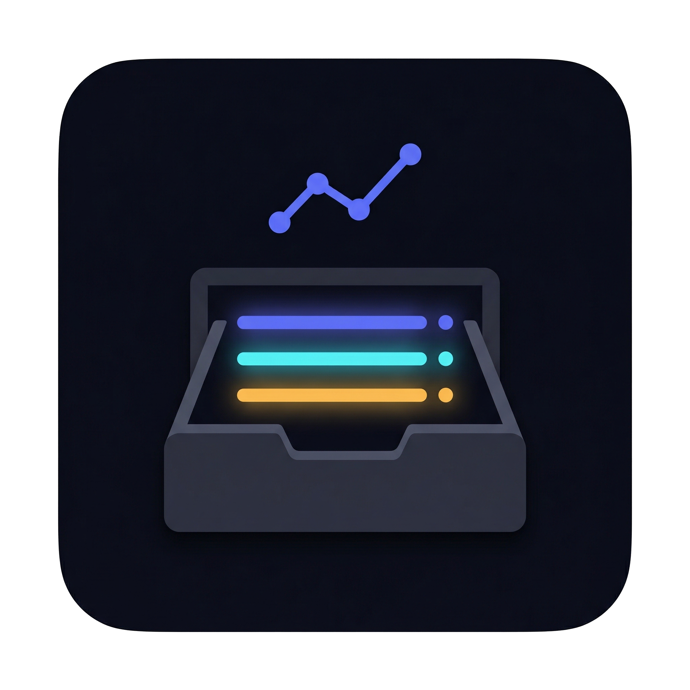
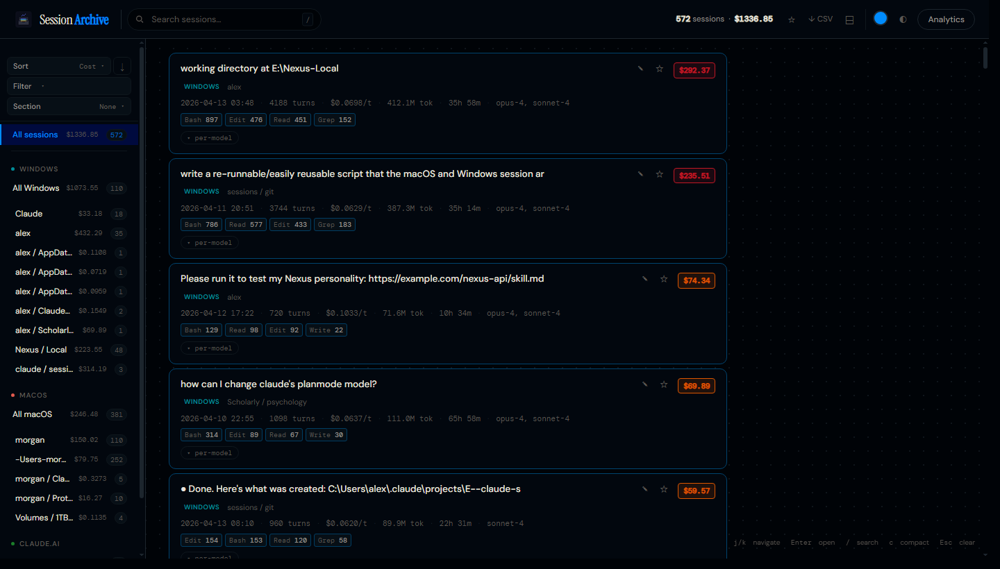
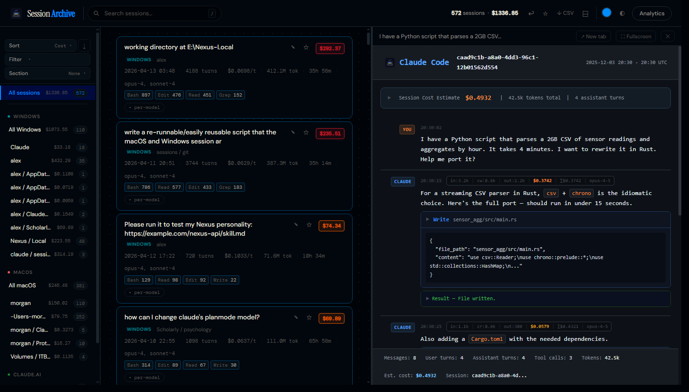
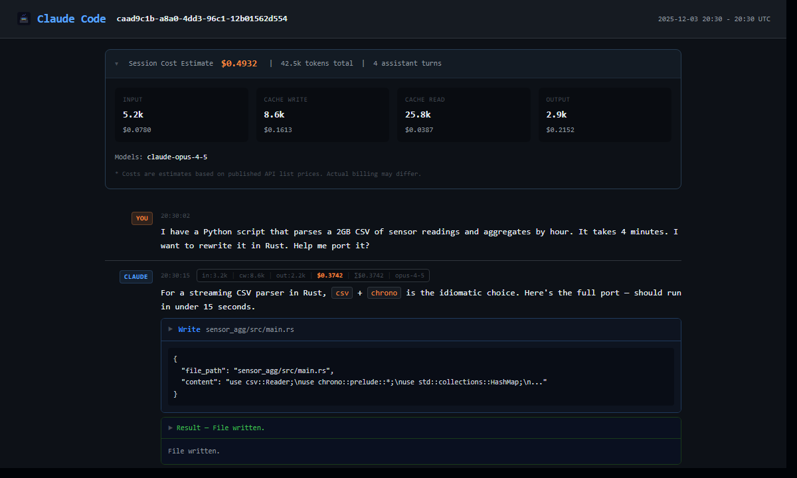
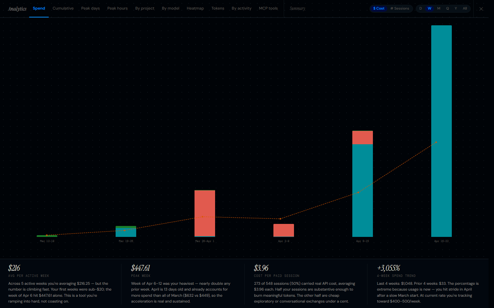
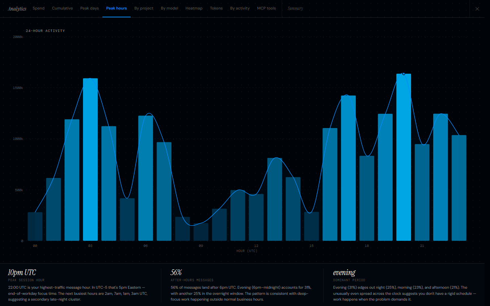
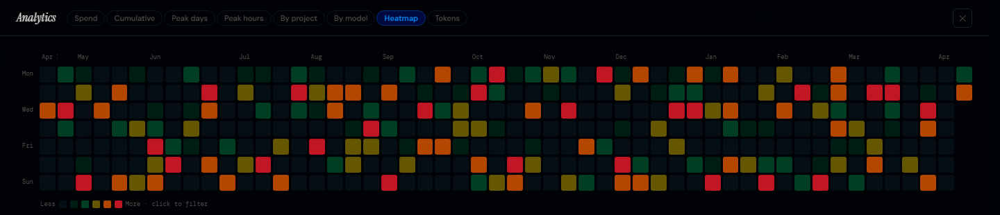
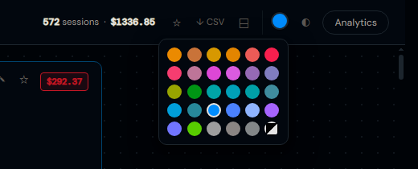

<p align="center">
  
</p>

<h1 align="center">Claude Code Session Archive</h1>

<p align="center">
  Browse, search, and analyse your entire Claude conversation history — locally, in the browser, with no accounts or API calls.
</p>

<p align="center">
  <a href="https://s1lentblade.github.io/claude-code-session-viewer/demo/example-index.html"><strong>→ Live demo</strong></a>
</p>

---

Claude Code stores every session as a `.jsonl` file on disk and gives you no way to read them. This tool converts them into a fast, searchable, themed HTML archive you open in any browser. No server, no database, no dependencies — pure standard-library Python and a single self-contained HTML file.



---

## Quick start

```bash
# Windows
refresh.bat

# macOS / Linux
chmod +x refresh.sh && ./refresh.sh
```

That's it. The script syncs sessions from this machine, builds the archive, and opens `index.html`.

**Python 3.8+, zero third-party packages.**

> Want plain-language analytics narration? Open the project in Claude Code (or any LLM with file access) and run `/generate-insights`

---

## The index

Every session on one page. The sidebar shows cost and session counts per platform and per project folder, so you can navigate straight to what you want without scrolling.

Each card shows:
- Session title and project path
- Date, duration, turn count, token count, cost-per-turn
- Model used (Opus / Sonnet / Haiku)
- Tool tags — `Read ×3`, `Edit ×2`, `Bash ×1` etc.
- Cost badge — colour-coded from green → orange → red by spend
- Star button to pin sessions for later

**Toolbar controls:** regex search · sort by date / cost / turns / duration · model filter · cost range slider · date range picker · tool-type filter · starred-only toggle · group by project · CSV export

---

## Inline session viewer



Click any card to open the transcript in a split panel — no navigation away from the list. The divider is **draggable**: grab the thin bar between the panels and pull to any width. Your preferred split persists across sessions.

`Ctrl+click` / `⌘+click` opens in a new tab instead. `↗ New tab` button in the viewer topbar does the same.

---

## Session view



Each `.jsonl` becomes a standalone HTML page:

- **Per-turn cost and cumulative total** — see exactly what each response cost
- **Tool call blocks** — collapsible, with the tool name, input, and output
- **Syntax-highlighted code** — in both tool inputs and Claude's responses
- **Copy buttons** — one-click copy on every message and code block
- **Session summary bar** — messages, turns, tokens, total cost at a glance

---

## Analytics

Press **`a`** or click **Analytics** in the topbar to open the full-screen analytics overlay.

### Spend



Bar chart of API cost switchable between **Daily / Weekly / Monthly** granularity. Weekly bars show full date ranges. Includes a 4-week rolling average trend line and an optional weekly budget alert line. Insight cards below show avg per active week, peak week, spend trend, and cost per paid session.

### Peak hours



AM and PM panels showing cost by hour of day. Bar colour scales from dark navy → bright blue by activity intensity — making your heaviest hours immediately obvious.

### Heatmap



GitHub-style 52-week activity grid. Cells scale to fill the full screen width; a 5-level colour gradient runs from light to deep red by spend. **Click any cell** to filter the main session list to that exact day.

### By model

Horizontal bars for Opus, Sonnet, and Haiku showing cost and session count. Insight cards show sessions on each model, avg cost comparison, and Opus share of total spend.

### All tabs

| Tab | What it shows |
|-----|--------------|
| Spend | Daily / Weekly / Monthly cost bars + trend line |
| Cumulative | Running total spend over all time |
| Peak days | Day-of-week usage distribution |
| Peak hours | Hour-of-day cost breakdown |
| By project | Cost and sessions per project, ranked |
| By model | Opus / Sonnet / Haiku split |
| Heatmap | 52-week activity grid, click to filter |
| Tokens | Input / cache write / cache read / output totals + cache hit rate |

---

## Themes



30 built-in colour themes, switched from the swatch grid in the topbar. Your choice persists in localStorage.

Amber · Copper · Gold · Gruvbox · Coral · Crimson · Rose · Sakura · Fuchsia · Dracula · Dusk · Lavender · Lime · Forest · Teal · Cyan · Solarized · Arctic · Sky · Nord · **Blurple** · Indigo · Catppuccin · Violet · Plasma · Neon · Mono · Warm Slate · Cool Slate · AMOLED

Each theme ships in both light and dark variants — toggle with the `◐` button or press **`d`**.

---

## Compact view

Press **`c`** or the compact button in the topbar to switch to a single-line-per-session layout — useful for large archives where you want to scan hundreds of sessions at once without scrolling.

---

## Keyboard shortcuts

| Key | Action |
|-----|--------|
| `/` | Focus search |
| `j` / `↓` | Next session |
| `k` / `↑` | Previous session |
| `Enter` | Open session in split panel |
| `Escape` | Close panel · clear search |
| `s` | Star / unstar selected session |
| `c` | Toggle compact view |
| `g` | Toggle group-by-project |
| `a` | Open / close analytics |
| `t` | Cycle to next theme |
| `d` | Toggle dark / light mode |

---

## All commands

```bash
# Sync from this machine and rebuild everything
python scripts/build_session_archive.py --sync

# Incremental build — only re-renders changed sessions
python scripts/build_session_archive.py

# Force re-render all sessions (e.g. after updating the renderer)
python scripts/build_session_archive.py --force

# Rebuild the index only, skip session re-renders
python scripts/build_session_archive.py --index-only

# Convert a single session file
python scripts/jsonl_to_html.py path/to/session.jsonl
python scripts/jsonl_to_html.py path/to/session.jsonl output.html

# Merge archives from multiple machines into one index
python scripts/merge_archives.py
```

---

## Multi-machine setup

If you use Claude Code on multiple machines (e.g. Windows + Mac), you can merge all sessions into a single index.

**On each machine**, sync and build:

```bash
python scripts/build_session_archive.py --sync
```

This copies sessions into `RAWEVERYTHING/{OS}/projects/` and renders them to `{OS}/archive/`. Put the whole repo on a shared or portable drive.

**Then anywhere**, merge:

```bash
python scripts/merge_archives.py
```

One `index.html` combining all platforms, with a colour-coded platform badge on each card and a per-platform breakdown in the sidebar.

```
RAWEVERYTHING/
  Windows/projects/     ← raw JSONL from Windows
  macOS/projects/       ← raw JSONL from macOS
Windows/archive/        ← rendered HTML for Windows sessions
macOS/archive/          ← rendered HTML for macOS sessions
index.html              ← unified index
```

---

## Importing Claude.ai conversations

Export your claude.ai history and bring it into the same archive alongside Claude Code sessions.

**Step 1** — Export from claude.ai:
> Settings → Account → Export Data

This downloads a zip with `conversations.json` and optionally `projects.json`.

**Step 2** — Run the importer:

```bash
# Conversations only
python scripts/import_claude_export.py conversations.json

# With project grouping
python scripts/import_claude_export.py conversations.json projects.json
```

**Step 3** — Rebuild the index:

```bash
python scripts/merge_archives.py
```

Each conversation becomes a card with a **Claude.ai** platform badge, grouped by project if `projects.json` was provided.

---

## Where your session files are

| Platform | Path |
|----------|------|
| macOS / Linux | `~/.claude/projects/{project}/` |
| Windows | `C:\Users\{you}\.claude\projects\{project}\` |

Each folder name is the working directory path with `/` replaced by `--`. If `$CLAUDE_CONFIG_DIR` is set, that path is used instead of `~/.claude`.

---

## Cost estimates

Token counts are read from the JSONL metadata. Costs are estimated from published API list prices — treat them as approximations.

| Model | Input | Cache write | Cache read | Output |
|-------|-------|-------------|------------|--------|
| Claude Opus 4 | $15/MTok | $18.75/MTok | $1.50/MTok | $75/MTok |
| Claude Sonnet 4 | $3/MTok | $3.75/MTok | $0.30/MTok | $15/MTok |
| Claude Haiku 4 | $0.80/MTok | $1.00/MTok | $0.08/MTok | $4/MTok |

---

## Prerequisites

- Python 3.8+
- No third-party packages — standard library only

macOS ships Python 3. On Windows: [python.org](https://python.org) or `winget install Python.Python.3`.
